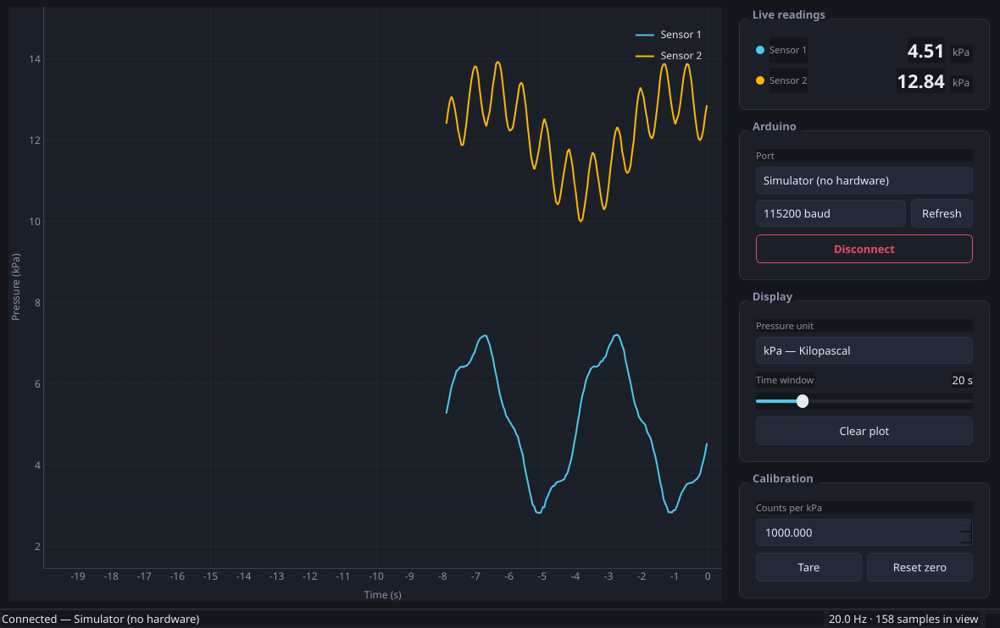

# Dual HX710B Pressure Monitor

Reads two HX710B pressure sensors streamed from an Arduino over a serial port
and plots both of them in real time.



The window has the plot on the left and the controls on the right:

| Control | What it does |
| --- | --- |
| **Live readings** | The newest value of each sensor, colour matched to its curve |
| **Port** + **Connect** | Picks the Arduino's serial port and starts/stops acquisition |
| **Pressure unit** | kPa, mmHg or atm; the whole plot is re-scaled instantly |
| **Time window** | How much history is visible, from 10 s to 60 s |
| **Calibration** | Counts per kPa, plus **Tare** to make the current readings zero |

## Hardware

Two HX710B modules, each driven with its own clock and data pin:

| HX710B | Arduino |
| --- | --- |
| Sensor 1 OUT | D2 |
| Sensor 1 SCK | D3 |
| Sensor 2 OUT | D4 |
| Sensor 2 SCK | D5 |
| VCC | 5V |
| GND | GND |

The pins are the `DATA_PINS` and `CLOCK_PINS` tables at the top of
`arduino/dual_hx710b/dual_hx710b.ino` if you wired yours differently.

## Firmware

Open `arduino/dual_hx710b/dual_hx710b.ino` in the Arduino IDE and upload it. It
needs no libraries. Each acquisition is printed as one line:

```
<raw sensor 1>,<raw sensor 2>
```

The values are the signed 24-bit readings of the HX710B; the conversion to a
pressure happens on the PC so it can be changed without reflashing. Lines
starting with `#` are diagnostics and are ignored by the application.

The parser is deliberately forgiving, so existing firmware often works without
changes: fields may be separated by commas, semicolons or whitespace, an extra
leading field such as a `millis()` timestamp is ignored, and firmware that
already sends kilopascals only needs the span set to 1 count per kPa.

## Install and run

Python 3.10 or newer:

```bash
pip install -r requirements.txt
python -m pressure_monitor
```

Useful flags when you always use the same board:

```bash
python -m pressure_monitor --port /dev/ttyACM0 --baud 115200 --connect
python -m pressure_monitor --port sim --connect   # built-in simulator
```

The selected port, baud rate, unit, time window and span are remembered between
sessions. The zero point is not: a tare from a previous session would silently
offset every reading, so tare again after connecting.

### No Arduino at hand?

Pick **Simulator (no hardware)** in the port list. It generates two synthetic
pressure signals at 20 Hz so the interface can be exercised end to end.

## Calibration

The HX710B reports raw ADC counts, so two numbers turn them into a pressure:

1. **Zero** — with both sensors at ambient pressure, press **Tare**. The current
   raw counts become 0 kPa. **Reset zero** undoes it.
2. **Span** — apply a pressure you know (a water column is convenient: 10 cm of
   water is 0.98 kPa) and adjust **Counts per kPa** until the reading matches.

Both sensors share the span, since they are the same model, but each keeps its
own zero.

## Layout

```
pressure_monitor/
    app.py            entry point and command line arguments
    protocol.py       parsing of the serial lines
    calibration.py    raw counts -> kilopascals
    units.py          kPa / mmHg / atm conversions
    buffers.py        the rolling window of recent samples
    reader.py         acquisition thread feeding the UI
    sources.py        serial port, port discovery and the simulator
    ui/               plot, controls, main window and colour scheme
arduino/dual_hx710b/  the sketch to upload to the board
tests/                unit tests for everything outside the UI
```

Samples are stored as raw counts and converted only when drawn, so changing the
unit, the span or the zero point immediately corrects the history on screen as
well as the new data.

## Tests

```bash
pip install pytest
python -m pytest
```

## Troubleshooting

**No ports in the list.** Press **Refresh** after plugging the board in. On
Linux you may need to be in the `dialout` group (`sudo usermod -aG dialout
$USER`, then log out and back in).

**Connects but no data.** Check that the baud rate matches `SERIAL_BAUD` in the
sketch (115200 by default), and that the Serial Monitor of the Arduino IDE is
closed — only one program can hold the port.

**Readings are huge or tiny.** That is the calibration, not the wiring: press
**Tare**, then set **Counts per kPa**.

**Readings stop updating.** Open the sketch's own output in a serial monitor: it
prints `# sensor N not responding` when a module never signals a ready
conversion, which is usually a swapped OUT/SCK pair or a loose ground.
